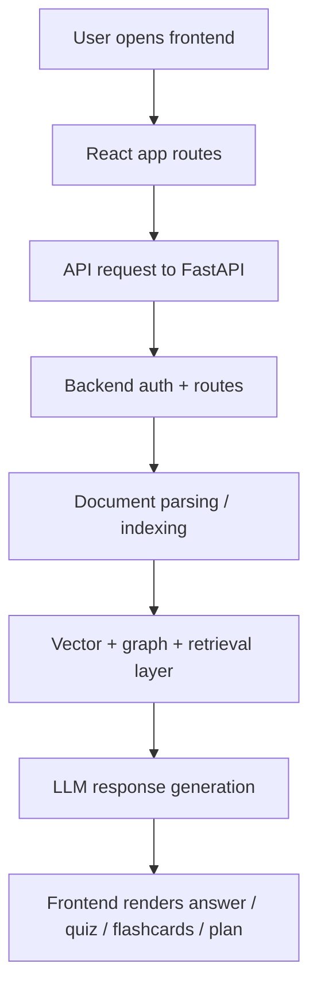

# DeepTutor Project Structure and How It Works

This repository is a full-stack AI tutoring application that combines a React frontend, a FastAPI backend, and an AI retrieval pipeline for document-based learning.

## 1. Project Overview

The application is designed to:

- let users upload study materials
- extract and index document content
- retrieve relevant context using vector and hybrid search
- answer questions with an LLM
- generate quizzes, flashcards, and study plans
- track learning progress in a dashboard

The current backend architecture uses a layered AI flow and has multiple provider options for LLMs, embeddings, and storage.

---

## 2. Repository Structure

```text
DeepTutor-1/
├── AGENTS.md
├── PROJECT_STRUCTURE.md
├── README.md
├── PROJECT_OVERVIEW.md
├── implementation_plan.md
├── techstack.md
├── compose.yml
├── vercel.json
├── DeepTutor_API_Documentation.pdf
├── Screenshot 2026-08-05 160515.png
├── TextBook/
├── backend/
│   ├── app/
│   │   ├── __init__.py
│   │   ├── main.py
│   │   ├── mcp_client.py
│   │   ├── mcp_server.py
│   │   ├── api/
│   │   │   ├── __init__.py
│   │   │   ├── auth.py
│   │   │   ├── chat.py
│   │   │   ├── dashboard.py
│   │   │   ├── documents.py
│   │   │   ├── endpoints/
│   │   │   ├── flashcards.py
│   │   │   ├── leaderboard.py
│   │   │   ├── mcp.py
│   │   │   ├── notes.py
│   │   │   ├── progress.py
│   │   │   ├── quiz.py
│   │   │   ├── study.py
│   │   │   ├── study_plan.py
│   │   │   └── ...
│   │   ├── core/
│   │   │   ├── __init__.py
│   │   │   ├── config.py
│   │   │   ├── database.py
│   │   │   ├── models.py
│   │   │   └── security.py
│   │   ├── rag/
│   │   │   ├── __init__.py
│   │   │   ├── curriculum_catalog.py
│   │   │   ├── decision_agent.py
│   │   │   ├── doc_processor.py
│   │   │   ├── exam_generator.py
│   │   │   ├── gemini_client.py
│   │   │   ├── ollama_client.py
│   │   │   ├── query_analyzer.py
│   │   │   ├── session_manager.py
│   │   │   ├── sqlite_fts_store.py
│   │   │   ├── teaching_engine.py
│   │   │   ├── topic_extractor.py
│   │   │   ├── user_memory.py
│   │   │   └── vlm_client.py
│   │   └── services/
│   │       └── ...
│   ├── data/
│   ├── faiss_data/
│   ├── graph_data/
│   ├── lightrag_data/
│   ├── chroma_data/
│   ├── uploads/
│   ├── vlm_cache/
│   ├── image_search_cache/
│   ├── tests/
│   ├── requirements.txt
│   ├── requirements-core.txt
│   ├── requirements-dev.txt
│   ├── requirements-ocr.txt
│   ├── reset_db.py
│   ├── reset_learn_dataset.py
│   ├── start.bat
│   └── ...
├── frontend/
│   ├── index.html
│   ├── package.json
│   ├── vite.config.ts
│   ├── tsconfig.json
│   ├── tsconfig.app.json
│   ├── tsconfig.node.json
│   ├── netlify.toml
│   ├── vercel.json
│   ├── public/
│   └── src/
│       ├── App.tsx
│       ├── main.tsx
│       ├── index.css
│       ├── assets/
│       ├── components/
│       ├── pages/
│       ├── services/
│       ├── stores/
│       ├── utils/
│       └── scratch/
├── documentation/
│   ├── README.md
│   ├── PROJECT_OVERVIEW.md
│   ├── techstack.md
│   ├── backend/
│   ├── development/
│   ├── devops/
│   ├── evaluations/
│   └── frontend/
├── infra/
│   ├── README.md
│   ├── bootstrap/
│   ├── local/
│   └── terraform/
├── scripts/
│   ├── dev-check.ps1
│   └── dev-setup.ps1
└── .github/
```

---

## 3. Main Components

### Frontend
Location: `frontend/src`

This is the user-facing application built with React + TypeScript + Vite.

Key files:

- `frontend/src/App.tsx` — route setup and app shell
- `frontend/src/pages/` — pages such as dashboard, chat, quiz, flashcards, study plan
- `frontend/src/components/` — reusable UI sections
- `frontend/src/services/` — API calls and data access
- `frontend/src/stores/` — state management

The frontend is responsible for:

- login and auth flow
- document upload UI
- chat interface
- study plan and quiz displays
- dashboards and records

### Backend
Location: `backend/app`

This is the actual application server built with FastAPI.

Key files:

- `backend/app/main.py` — app startup, router registration, health checks
- `backend/app/core/config.py` — environment settings, model selection, parser settings, vector store config
- `backend/app/core/database.py` — database access
- `backend/app/core/models.py` — DB schemas
- `backend/app/api/` — HTTP route handlers for auth, docs, chat, quiz, flashcards, study plans
- `backend/app/rag/` — retrieval and generation logic

This layer handles:

- API routes
- data validation
- storage setup
- retrieval
- model orchestration
- document ingestion workflows

### Data and AI Storage
The project contains several storage areas for different pieces of the system:

- `backend/uploads/` — uploaded documents
- `backend/chroma_data/` — vector store files
- `backend/faiss_data/` — FAISS-based vector index
- `backend/graph_data/` and `backend/lightrag_data/` — graph and retrieval data
- `backend/vlm_cache/` and `backend/image_search_cache/` — cached analyzed content

---

## 4. How the System Works

### Step 1: Frontend User Interaction
A user opens the React app and navigates through pages such as:

- dashboard
- subject workspace
- chat
- quiz
- flashcards
- study plan

The app communicates with the backend through API service layers in `frontend/src/services` and stores shared state in `frontend/src/stores`.

### Step 2: Backend Startup
When the FastAPI app starts, `backend/app/main.py` runs the startup lifecycle:

- creates required directories
- initializes storage folders
- prints provider settings
- loads API routers

The root `/health` and `/api/health` endpoints verify the app is running and check whether the LLM and database are available.

### Step 3: Configuration
`backend/app/core/config.py` centralizes configuration for:

- LLM provider (`gemini`, `ollama`, `azure_openai`)
- embedding provider
- vector backend (`pinecone`, `faiss`, `chroma`)
- graph backend
- parser selection (`pymupdf`, `docling`, etc.)
- upload limits and cache settings

This makes the project provider-agnostic and easy to switch between local and cloud AI services.

### Step 4: Document Upload and Processing
When a user uploads a document:

1. the frontend sends the file to the backend API
2. backend routes handle the upload in `backend/app/api/documents.py`
3. file data is stored in `backend/uploads/`
4. the document pipeline parses pages and extracts text
5. text is chunked into semantic chunks
6. chunks are embedded and stored in a vector store for retrieval

The parser and retrieval logic are located under `backend/app/rag/` and are highly configurable through settings in `config.py`.

### Step 5: Retrieval-Augmented Generation (RAG)
The actual learning flow is built around a retrieval pipeline:

- input question from the user
- query analysis and expansion logic
- retrieval from vector store and/or hybrid search
- ranking and contextual filtering
- selected relevant chunks are sent to the LLM
- LLM responds with grounded answers using the document context

This is the core of the “AI tutor” behavior.

### Step 6: Quiz, Flashcards, and Study Plan Generation
The backend also includes dedicated endpoints for learning tools:

- `quiz.py` → generates quizzes from relevant course content
- `flashcards.py` → creates flashcards
- `study_plan.py` → creates structured learning schedules
- `dashboard.py` / `progress.py` → tracks usage and performance

These features use the same retrieval context but tailor the output for learning workflows rather than raw chat answers.

### Step 7: Response to the Frontend
The frontend receives structured JSON responses from the backend and renders the results in the interface.

For example:

- chat answer appears in the chat panel
- quiz result or explanations are displayed on quiz pages
- flashcards are rendered as interactive study content
- study plan items are shown as task lists and progress indicators

---

## 5. Typical Runtime Flow



A typical request path is:

1. User types a question or uploads a file in the React UI.
2. Frontend sends the request to the backend route.
3. Backend validates and processes the request.
4. Retrieval layer gathers relevant context.
5. LLM generates a response grounded in the retrieved information.
6. Frontend displays the answer and updates the learning UI.

---

## 6. Important Technical Attributes

### Provider flexibility
The project supports multiple providers for different roles:

- LLM provider: Gemini, Ollama, Azure OpenAI
- Embedding provider: Gemini, OpenAI, Ollama, Azure OpenAI
- Vector store backend: pinecone, faiss, chroma
- Graph store backend: json_kv, networkx

This is configured in `backend/app/core/config.py`.

### Retrieval pipeline design
The project is designed around a hybrid AI architecture that combines:

- document parsing
- chunking
- embeddings
- vector search
- graph or structured retrieval
- final LLM answer generation

This is the core reason the project can provide tutor-like, document-grounded answers.

### App architecture style
The project is organized in layered style:

- presentation layer: React frontend
- service layer: FastAPI endpoints and app services
- retrieval layer: RAG logic
- data layer: storage and indexes
- model layer: LLM and embedding providers

---

## 7. How to Run the Project

### Backend
From repository root:

```bash
cd backend
python -m venv .venv
.venv\Scripts\activate
pip install -r requirements.txt
uvicorn app.main:app --reload --port 8000
```

### Frontend
From repository root:

```bash
cd frontend
npm install
npm run dev
```

Then open the local frontend URL shown by Vite.

---

## 8. Summary

This project is a document-based AI tutor and learning platform. The frontend provides the interactive student experience, while the backend and RAG stack handle parsing, indexing, retrieval, and answer generation. The result is a system that can read uploaded documents, understand context, answer questions, and create study materials for learners.

If you want to understand the project deeply, the most important files to inspect first are:

- `backend/app/main.py`
- `backend/app/core/config.py`
- `backend/app/api/`
- `backend/app/rag/`
- `frontend/src/App.tsx`
