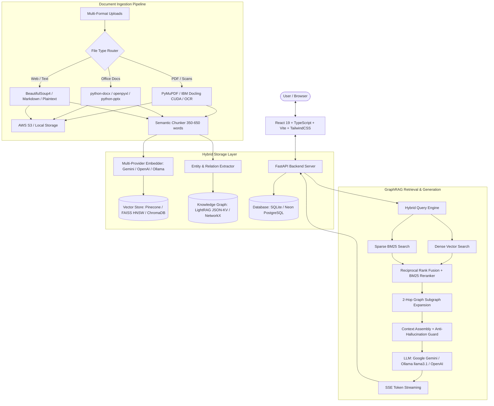

# 🎓 DeepTutor — Next-Gen AI GraphRAG Learning Platform

[](https://fastapi.tiangolo.com/)
[](https://react.dev/)
[](https://www.typescriptlang.org/)
[](https://tailwindcss.com/)
[](https://python.org/)
[](https://ai.google.dev/)
[](https://pinecone.io/)
[](https://www.netlify.com/)
[](https://opensource.org/licenses/MIT)

> **DeepTutor** is an advanced, privacy-first AI learning and tutoring platform powered by a hybrid **GraphRAG architecture** — combining Dense Vector Search, Sparse BM25 Keyword Matching, and Knowledge Graph Subgraph Reasoning to answer questions strictly grounded in your study documents.

---

## 🌟 Key Features

| Feature | Description |
|:---|:---|
| 🧠 **Hybrid GraphRAG Engine** | Dense embeddings (Gemini / OpenAI / Ollama) + BM25 keyword search + Reciprocal Rank Fusion (RRF) + Knowledge Graph context + Hallucination Guard. |
| 📑 **Universal Document Parsing & OCR** | High-speed C++ extraction with PyMuPDF, IBM Docling layout vision with CUDA GPU acceleration, EasyOCR / Tesseract for scanned docs & images, plus DOCX, XLSX, PPTX, CSV, HTML, MD support. |
| 📊 **Interactive Knowledge Graph** | 2D Force-directed interactive canvas (`d3-force`) rendering entity nodes, relationship edges, topic clusters, and contextual snippets. |
| 🎮 **Gamified AI Quiz Engine** | Generate tailored multiple-choice quizzes with adaptive difficulty, noise-filtered entity chips, instant explanations, XP rewards, and streak multipliers. |
| 🎴 **3D Flippable Flashcards with TTS** | 3D perspective flip cards with keyboard navigation (`Space`, `Arrow` keys) and built-in Text-to-Speech (TTS) voice pronunciation. |
| 📅 **AI Study Plan Roadmap** | Exam-targeted countdown scheduler constructing day-by-day learning roadmaps with interactive progress tracking. |
| 📚 **Subjects & Workspaces** | Organize learning materials into structured Subjects, Topics, and Sessions with collection-scoped indexing. |
| 🔌 **Model Context Protocol (MCP)** | Built-in FastMCP server and frontend MCP drawer enabling tool invocation and external AI client interoperability. |
| 🏆 **Leaderboard & XP Analytics** | Track mastery, learning streaks, accuracy percentages, badges, and compete on global/subject leaderboards. |
| 🧪 **RAG Evaluation Suite** | Integrated benchmarks using **DeepEval** and **Ragas** measuring Context Precision, Hit Rate, MRR, Faithfulness, Latency, and TPS. |
| ☁️ **Flexible Local & Cloud Modes** | Run 100% locally & air-gapped via Ollama + FAISS, or in the cloud with Google Gemini + Pinecone Serverless + AWS S3 storage. |

---

## 🏗️ System Architecture



---

## 🛠️ Technology Stack

| Layer | Technologies |
|:---|:---|
| **Frontend** | React 19, TypeScript 5.7, Vite 8, Tailwind CSS v4, Framer Motion, Zustand, TanStack Query, Lucide Icons, Recharts |
| **Backend Framework** | FastAPI 0.111+, Python 3.11–3.13, Uvicorn, Gunicorn, Pydantic v2, Pydantic-Settings |
| **Database & ORM** | SQLAlchemy 2.0, aiosqlite (SQLite) / asyncpg / psycopg2 (PostgreSQL) |
| **Vector Databases** | Pinecone Serverless (Cloud), FAISS HNSW (High-Performance Local), ChromaDB (Fallback) |
| **Knowledge Graph** | LightRAG JSON-KV Key-Value Store, NetworkX Graph Traversal |
| **LLM & Embeddings** | Google Gemini (`gemini-3.1-flash-lite`, `gemini-embedding-2`), Ollama (`llama3.1`, `nomic-embed-text`), OpenAI (`text-embedding-3-small`) |
| **Document Parsers & OCR** | PyMuPDF (fitz), IBM Docling 2.0 (CUDA GPU accelerated), pdfplumber, EasyOCR, Tesseract, python-docx, openpyxl, python-pptx, BeautifulSoup4 |
| **Cloud Storage** | AWS S3 (`boto3`) / Local storage fallback |
| **Protocols & Evaluation** | FastMCP (Model Context Protocol), DeepEval v4.1.5, Ragas v0.4.3 |
| **Deployment Targets** | Netlify (Frontend), Vercel (Frontend), Render / VPS / Docker (Backend) |

---

## 🚀 Quick Start Guide

### Prerequisites

- **Python 3.11+** (Python 3.12 / 3.13 supported)
- **Node.js 18+** & `npm`
- **AI Provider** (Choose one):
  - **Cloud Mode (Fastest setup)**: A free [Google Gemini API Key](https://aistudio.google.com/)
  - **Local Mode (Air-gapped / Private)**: [Ollama](https://ollama.ai/) installed and running:
    ```bash
    ollama pull llama3.1
    ollama pull nomic-embed-text
    ```

---

### 1. Clone the Repository

```bash
git clone https://github.com/Harryy17/DeepTutor.git
cd DeepTutor
```

---

### 2. Backend Setup

```bash
cd backend

# Create & activate virtual environment
python -m venv .venv
.venv\Scripts\activate          # On Windows
# source .venv/bin/activate     # On macOS / Linux

# Install dependencies
pip install -r requirements.txt

# Configure environment variables
cp .env.example .env
```

Edit `backend/.env` with your preferred settings (see [Environment Variables Reference](#-environment-variables-reference)).

**Start the Backend Server:**

```bash
# Windows quick-start
.\start.bat

# Or manual start
uvicorn app.main:app --reload --port 8000
```

> 📖 Interactive Swagger API documentation will be available at: **http://localhost:8000/docs**

---

### 3. Frontend Setup

```bash
cd ../frontend

# Install dependencies
npm install

# Start development server
npm run dev
```

> 🌐 Open **http://localhost:5173** in your browser.

---

## ⚙️ Environment Variables Reference

Configure `backend/.env` to switch between local and cloud providers effortlessly:

```env
# ── Application & Security ───────────────────────────────────────────────────
APP_NAME="Deep Tutor API"
APP_VERSION="2.0.0"
DEBUG=True
SECRET_KEY="your-super-secret-key-change-in-production"
DATABASE_URL="sqlite+aiosqlite:///./deep_tutor.db"

# ── LLM Provider ("gemini" | "ollama") ──────────────────────────────────────
LLM_PROVIDER=gemini
GEMINI_API_KEY=your_gemini_api_key_here
GEMINI_CHAT_MODEL=gemini-3.1-flash-lite

# ── Embedding Provider ("gemini" | "ollama" | "openai") ──────────────────────
EMBEDDING_PROVIDER=gemini
GEMINI_EMBED_MODEL=models/gemini-embedding-2

# ── Local Ollama Fallback Settings ───────────────────────────────────────────
OLLAMA_BASE_URL=http://127.0.0.1:11434
OLLAMA_CHAT_MODEL=llama3.1
OLLAMA_EMBED_MODEL=nomic-embed-text

# ── Vector Store Backend ("pinecone" | "faiss" | "chroma") ───────────────────
VECTOR_STORE_BACKEND=faiss
FAISS_DATA_DIR=./faiss_data
FAISS_INDEX_TYPE=hnsw

# (Optional: If using Pinecone)
# PINECONE_API_KEY=your_pinecone_api_key
# PINECONE_INDEX_NAME=deeptutor

# ── Graph Store Backend ("json_kv" | "networkx") ─────────────────────────────
GRAPH_STORE_BACKEND=json_kv
LIGHTRAG_DATA_DIR=./lightrag_data

# ── Parser & Ingestion Settings ──────────────────────────────────────────────
PRIMARY_PARSER=pymupdf
ENABLE_DOCLING=False
CHUNKING_STRATEGY=semantic
CHUNK_MIN_WORDS=350
CHUNK_MAX_WORDS=650

# ── AWS S3 Document Storage (Optional) ───────────────────────────────────────
# ENABLE_S3_STORAGE=True
# AWS_ACCESS_KEY_ID=your_aws_access_key
# AWS_SECRET_ACCESS_KEY=your_aws_secret_key
# AWS_S3_BUCKET_NAME=deeptutor-documents-storage
# AWS_REGION=eu-north-1
```

---

## 🌐 Deployment Guide

### Frontend Deployment

#### Option A: Netlify (Pre-configured)
1. Push your repository to GitHub.
2. Link your repository in [Netlify](https://www.netlify.com/).
3. Netlify automatically picks up `frontend/netlify.toml`:
   - **Base directory**: `frontend`
   - **Build command**: `npm run build`
   - **Publish directory**: `frontend/dist`
4. Set Environment Variable:
   - `VITE_API_BASE_URL` = `https://your-backend-api.onrender.com/api`
5. Click **Deploy**!

#### Option B: Vercel (Pre-configured)
1. Connect your repository to [Vercel](https://vercel.com/).
2. Root directory `vercel.json` provides automatic SPA single-page routing rewrites.
3. Configure build directory as `frontend` with output directory `dist`.
4. Set `VITE_API_BASE_URL` in environment variables and deploy.

---

### Backend Deployment

#### Option A: Render
1. Create a **New Web Service** on [Render](https://render.com/).
2. Set build & start commands:
   - **Build command**: `pip install -r backend/requirements.txt`
   - **Start command**: `cd backend && uvicorn app.main:app --host 0.0.0.0 --port $PORT`
3. Configure your environment variables (`SECRET_KEY`, `GEMINI_API_KEY`, etc.).

#### Option B: Docker Container
Build and run using the included production Dockerfile:

```bash
cd backend
docker build -t deeptutor-backend .
docker run -p 8000:8000 --env-file .env deeptutor-backend
```

---

## 📡 REST & Streaming API Endpoints

| Category | Method | Endpoint | Description |
|:---|:---|:---|:---|
| **System** | `GET` | `/health` | Live health probe, database status, vector & graph store metrics. |
| **Auth** | `POST` | `/api/auth/register` | Register new user account. |
| **Auth** | `POST` | `/api/auth/login` | Authenticate user & issue JWT bearer token. |
| **Auth** | `GET` | `/api/auth/me` | Fetch authenticated user profile and tier limits. |
| **Documents** | `POST` | `/api/documents/upload` | Multi-format file ingestion, parsing, chunking, and embedding. |
| **Documents** | `GET` | `/api/documents/` | List user uploaded documents and indexing statuses. |
| **Documents** | `DELETE`| `/api/documents/{doc_id}` | Delete document and remove associated vector/graph nodes. |
| **Chat & RAG** | `POST` | `/api/chat/stream` | Server-Sent Events (SSE) streaming GraphRAG answer generation. |
| **Chat & RAG** | `GET` | `/api/chat/sessions` | List active user chat sessions. |
| **Chat & RAG** | `GET` | `/api/chat/graph/{session_id}` | Retrieve 2D force-directed knowledge graph subgraphs. |
| **Quiz** | `POST` | `/api/quiz/generate` | Generate document-grounded multiple-choice quizzes. |
| **Quiz** | `POST` | `/api/quiz/submit` | Submit quiz answers, score attempt, calculate XP and streaks. |
| **Flashcards** | `POST` | `/api/flashcards/generate` | Create flippable 3D study flashcards from document context. |
| **Study Plan** | `POST` | `/api/study-plan/generate` | Generate exam-targeted day-by-day roadmap schedule. |
| **Progress** | `GET` | `/api/progress/summary` | Retrieve learning analytics, accuracy rates, and badge progress. |
| **Leaderboard** | `GET` | `/api/leaderboard/` | Fetch global and subject-specific XP leaderboards. |
| **MCP** | `POST` | `/mcp/` | Model Context Protocol tool execution endpoint. |

---

## 📁 Project Structure

```
DeepTutor/
├── backend/
│   ├── app/
│   │   ├── api/                      # REST API & SSE streaming routers
│   │   │   ├── auth.py               # JWT authentication & user accounts
│   │   │   ├── chat.py               # GraphRAG streaming chat & graph endpoints
│   │   │   ├── documents.py          # Multi-format ingestion & document management
│   │   │   ├── flashcards.py         # AI Flashcard generation
│   │   │   ├── quiz.py               # Gamified Quiz engine & scoring
│   │   │   ├── study_plan.py         # Day-by-day exam roadmap planner
│   │   │   ├── progress.py           # User analytics, stats, badges
│   │   │   ├── leaderboard.py        # XP rankings & competitive leaderboard
│   │   │   └── mcp.py                # Model Context Protocol integration
│   │   ├── core/                     # Application configuration & database models
│   │   │   ├── config.py             # Pydantic Settings & environment manager
│   │   │   ├── database.py           # SQLAlchemy async session management
│   │   │   └── models.py             # User, Session, Document, Quiz, Progress schemas
│   │   └── rag/                      # Advanced 4-Stage GraphRAG Pipeline
│   │       ├── pipeline/             # Parsers (PyMuPDF, Docling), Chunkers, Embedders
│   │       ├── storage/              # Vector stores (FAISS, Pinecone) & Graph stores (JSON-KV)
│   │       ├── query_engine.py       # Hybrid Dense + BM25 search & RRF fusion
│   │       ├── graph_rag.py          # Subgraph traversal & context assembly
│   │       ├── hallucination_guard.py# Grounding verification & out-of-scope detector
│   │       ├── gemini_client.py      # Google Gemini Flash / Pro API client
│   │       └── ollama_client.py      # Local Ollama client & streaming engine
│   ├── evaluations/                  # RAG evaluation datasets & benchmark configs
│   ├── Dockerfile                    # Production multi-worker container image
│   ├── evaluate_rag.py               # Automated RAG evaluation benchmark runner
│   ├── requirements.txt              # Python backend dependencies
│   ├── start.bat                     # Windows one-click auto launcher
│   └── .env.example                  # Environment variables template
├── frontend/
│   ├── src/
│   │   ├── components/               # UI components (Graph visualizer, 3D Flashcards, Quiz)
│   │   ├── pages/                    # Chat, Dashboard, Subjects, StudyPlan, Leaderboard
│   │   ├── services/                 # Axios API clients & SSE streaming listeners
│   │   └── stores/                   # Zustand state management (auth, chat)
│   ├── netlify.toml                  # Netlify build & redirect rules
│   ├── package.json                  # Frontend scripts & NPM dependencies
│   └── vite.config.ts                # Vite build configuration
├── vercel.json                       # Vercel SPA routing rewrites
└── README.md                         # Project documentation
```

---

## 📊 RAG Benchmarking & Evaluation

DeepTutor includes a comprehensive evaluation suite powered by **DeepEval** and **Ragas**:

```bash
cd backend
python evaluate_rag.py
```

### Benchmark Metrics Tracked:
- 🎯 **Context Precision (@K)**: Ratio of retrieved chunks that are strictly relevant to the ground truth.
- 🎯 **Context Hit Rate**: Percentage of queries where the target information was retrieved.
- 🎯 **Mean Reciprocal Rank (MRR)**: Evaluates ranking position of the top relevant chunk.
- 🛡️ **Faithfulness (Anti-Hallucination)**: Verifies answers are strictly grounded in document context without synthetic hallucination.
- ⚡ **Retrieval Latency (P50 / P95)**: Sub-second retrieval performance benchmarks.
- 🚀 **Generation Throughput (TPS)**: Token generation speed across LLM backends.

Reports are automatically exported to `backend/rag_evaluation_report.md` and `backend/deepeval_ragas_evaluation.json`.

---

## 🤝 Contributing

We welcome contributions from the community!

1. **Fork the repository**
2. **Create a feature branch**:
   ```bash
   git checkout -b feature/amazing-feature
   ```
3. **Commit your changes**:
   ```bash
   git commit -m "feat: add amazing new feature"
   ```
4. **Push to the branch**:
   ```bash
   git push origin feature/amazing-feature
   ```
5. **Open a Pull Request**

---

## 📜 License

This project is licensed under the **MIT License** — see the [LICENSE](LICENSE) file for details.

---

<p align="center">
  Built with ❤️ by the <b>DeepTutor Team</b>.<br/>
  <i>Star ⭐ this repository if you find it helpful!</i>
</p>
