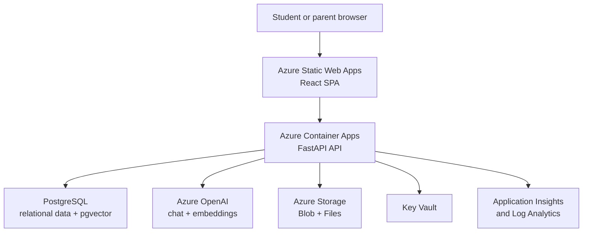
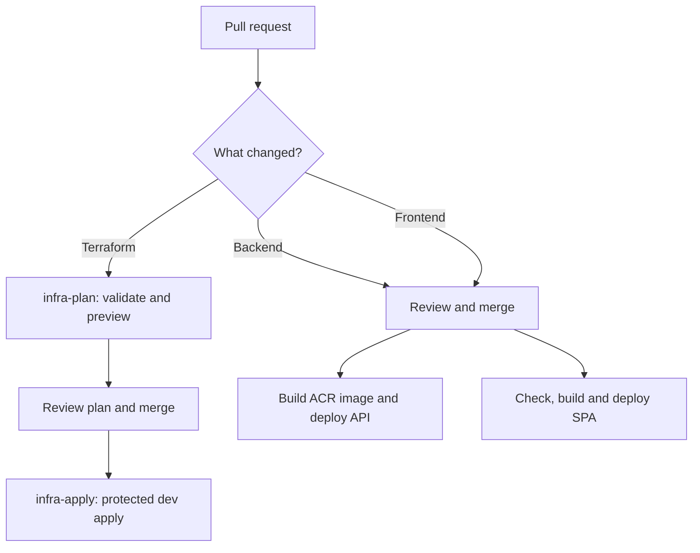

# DeepTutor DevOps and Azure Platform Guide

This document explains the **development Azure environment** and the automation
used to build, provision, and deploy DeepTutor. It is the starting point for
developers who need to understand where the application runs, how a code change
reaches Azure, and where to investigate a failed deployment.

> Scope: this describes the current `dev` environment defined by the repository.
> Terraform files and workflow files are the source of truth if this document
> ever disagrees with the code.

This Azure environment is the **deployed development environment**, not a
requirement that every developer run Azure services locally. The supported
Windows setup uses local PostgreSQL/pgvector and permits configurable chat
providers while preserving an Azure-compatible data contract. See
[`../development/local-windows-setup.md`](../development/local-windows-setup.md).

## 1. Platform at a glance

DeepTutor is a React single-page application backed by a containerized FastAPI
API. The current development platform is hosted in Azure and managed with
Terraform. GitHub Actions authenticates to Azure through OpenID Connect (OIDC),
so deployments do not store a long-lived Azure client secret in GitHub.

| Layer | Current technology | Azure service | Purpose |
|---|---|---|---|
| Frontend | React 19, TypeScript, Vite | Azure Static Web Apps | Hosts and serves the browser SPA over HTTPS |
| Backend | Python, FastAPI, Uvicorn, Docker | Azure Container Apps | Runs the REST API and scales the development API from zero to two replicas |
| Container images | `backend/Dockerfile.slim` | Azure Container Registry (Basic) | Builds and stores versioned backend images |
| Relational data | PostgreSQL + SQLAlchemy | Azure Database for PostgreSQL Flexible Server | Stores users, subjects, learning data, processing state, and application records |
| Vector retrieval | pgvector | PostgreSQL Flexible Server | Stores and searches Azure OpenAI embeddings |
| AI | `gpt-4.1-mini` and `text-embedding-3-small` deployments | Azure OpenAI | Chat/generation and embeddings, using managed identity |
| Durable files | Blob Storage and Azure Files | Azure Storage | Stores documents and artifacts; mounts upload and LightRAG directories into the API |
| Secrets | Runtime environment references | Azure Key Vault | Stores the database URL, JWT secret, and provider credentials when required |
| Identity | User-assigned managed identity | Microsoft Entra ID / Azure RBAC | Allows the API to pull images and access Key Vault, Storage, and Azure OpenAI without embedded passwords |
| Monitoring | Application Insights and Log Analytics | Azure Monitor | Collects application telemetry, container logs, and platform logs |
| Infrastructure | Terraform 1.9.8 | Azure Storage remote state | Defines and tracks the Azure environment |
| Delivery automation | GitHub Actions | GitHub + Azure OIDC | Plans infrastructure and deploys the backend and frontend |

The application resource group is `rg-deeptutor-dev`. Most resources are in
`centralindia`; Azure services with their own regional constraints use the
locations configured in Terraform.

## 2. Azure resources and ownership

Terraform owns the infrastructure. Developers should not make lasting resource
configuration changes manually in the Azure portal because the next Terraform
apply may reverse them or report configuration drift.

| Resource | Repository definition | Important current configuration |
|---|---|---|
| Resource group | `infra/terraform/main.tf` | `rg-deeptutor-dev` |
| Static Web App | `infra/terraform/static_web_app.tf` | Free tier; frontend calls the API through its public URL |
| Container App | `infra/terraform/container_apps.tf` | `ca-deeptutor-dev-api`; 0.5 vCPU, 1 GiB, min 0 and max 2 replicas |
| Container Registry | `infra/terraform/registry.tf` | Basic SKU; admin credentials disabled; managed-identity pulls |
| PostgreSQL | `infra/terraform/postgres.tf` | PostgreSQL Flexible Server `B_Standard_B1ms`, 32 GiB, TLS required |
| Azure OpenAI | `infra/terraform/openai.tf` | Enabled in `dev.tfvars`; local API-key authentication disabled |
| Storage | `infra/terraform/storage.tf` | Private Blob containers plus `lightrag-data` and `uploads` Azure Files shares |
| Key Vault | `infra/terraform/keyvault.tf` | RBAC authorization; seven-day soft delete in dev |
| Monitoring | `infra/terraform/main.tf` | Application Insights plus Log Analytics with a 0.2 GB/day ingestion cap |
| Managed identity | `infra/terraform/main.tf` | Shared application identity with narrowly assigned Azure roles |

The development API scales to zero when idle. The first request after inactivity
can therefore take longer while Azure starts a replica. This is expected dev
behaviour, not automatically an outage.

### Data placement

| Data | Current destination | Persistence behaviour |
|---|---|---|
| Application and user records | PostgreSQL | Durable, with Azure-managed backups |
| Embeddings | PostgreSQL with pgvector | Durable; documents must be re-indexed if the embedding model or dimensions change |
| Uploaded documents | Azure Files mount and private Blob Storage capability | Survives container revisions |
| LightRAG graph JSON | `lightrag-data` Azure Files mount | Survives container restarts; planned long-term target is PostgreSQL JSONB |
| VLM and image-search caches | Container temporary disk | Rebuildable and may disappear during a revision |
| Terraform state | Separate Azure Storage account/resource group | Kept outside the application resource group so application destroy does not remove state |

## 3. Authentication and secrets

There are two different identities involved:

1. **GitHub Actions identity:** GitHub presents an OIDC token to Azure. Azure
   trusts the configured repository branch, pull-request, and GitHub Environment
   subjects. Repository variables identify the Azure application, tenant, and
   subscription; there is no stored Azure client secret.
2. **Application managed identity:** the Container App uses a user-assigned
   identity to pull from ACR, read Key Vault secrets, use Blob Storage, and call
   Azure OpenAI.

Required GitHub repository variables:

| Variable | Used for |
|---|---|
| `AZURE_CLIENT_ID` | OIDC application/client identity |
| `AZURE_TENANT_ID` | Microsoft Entra tenant |
| `AZURE_SUBSCRIPTION_ID` | Azure subscription target |
| `TFSTATE_RESOURCE_GROUP` | Terraform state resource group |
| `TFSTATE_STORAGE_ACCOUNT` | Terraform state storage account |
| `TFSTATE_CONTAINER` | Terraform state Blob container |

The repository uses two GitHub Environments:

- `dev-plan` permits read-only Terraform planning for pull requests.
- `dev` controls infrastructure apply and application deployment. Protection
  rules on this environment are the human approval gate.

Never commit API keys, database passwords, deployment tokens, `.env` files, or
Terraform state. Application secrets belong in Key Vault. The Static Web Apps
deployment token is fetched from Azure during a workflow run and masked rather
than stored as a long-lived GitHub secret.

## 4. The four GitHub Actions workflows

The workflow files live in `.github/workflows/`.

### `infra-plan.yml` — preview infrastructure changes

Runs for pull requests that change `infra/terraform/**` or the workflow itself.
It authenticates through OIDC, checks Terraform formatting, initializes the
remote state backend, validates the configuration, and creates a plan against
the real dev state. The plan is posted to the PR and retained as a five-day
artifact.

It **does not modify Azure**. Reviewers must pay particular attention to any
`destroy` or resource replacement in the plan.

### `infra-apply.yml` — change Azure infrastructure

Runs after Terraform changes are pushed to `main`, or manually. It uses the
protected `dev` GitHub Environment and executes `terraform apply`.

The manual workflow also exposes `destroy: true`. That path removes resources
managed by this Terraform environment and is destructive. It must only be used
deliberately by an authorized operator after reviewing the target environment.
The PostgreSQL database has an additional `prevent_destroy` guard.

Terraform applies are never cancelled automatically because only one writer
should update remote state at a time.

### `deploy-backend.yml` — build and deploy the API

Runs when matching backend changes are pushed to a configured deployment branch,
or when started manually.

1. Authenticates to Azure using OIDC.
2. Resolves the ACR instance in `rg-deeptutor-dev`.
3. Builds `backend/Dockerfile.slim` remotely with `az acr build`.
4. Tags the image with the immutable Git commit SHA and `latest`.
5. Updates `ca-deeptutor-dev-api` to the SHA-tagged image.
6. Creates a new Container Apps revision.
7. Retries an HTTP smoke test because the API may be scaled to zero.
8. Prints revision state, system logs, and console logs when the smoke test fails.

The SHA tag provides traceability: the running image can be mapped back to the
exact Git commit.

### `deploy-frontend.yml` — build and deploy the SPA

Runs when matching frontend changes are pushed to a configured deployment
branch, or when started manually.

1. Installs Node.js 22 and dependencies with `npm ci`.
2. Resolves the current Container App hostname from Azure.
3. Runs lint and TypeScript checks.
4. Builds the Vite application with `VITE_API_BASE_URL` set to the live API's
   `/api` endpoint.
5. Fetches and masks the Static Web Apps deployment token.
6. Uploads `frontend/dist` to `stapp-deeptutor-dev`.

The backend URL is discovered at build time; developers should not hard-code an
Azure API hostname in frontend source or commit it in a production `.env` file.

> Temporary branch configuration: the two application deployment workflows
> currently include `feature/document-first-learning-flow` as well as `main`.
> This enabled pre-merge testing. Remove the feature branch trigger after the
> work is merged and verified so ordinary automatic deployment is `main`-only.

## 5. Change-to-deployment flow

Application code and infrastructure follow related but different paths.

Recommended order when both infrastructure and application changes are needed:

1. Merge and apply the infrastructure change.
2. Confirm required Azure resources, roles, and configuration exist.
3. Deploy the backend and verify its smoke test.
4. Deploy the frontend, which reads the live backend hostname.
5. Test the deployed user flow, including refresh and deep-link navigation.

Path filters mean unrelated documentation changes do not deploy the application.

## 6. Developer responsibilities

Before opening a PR:

- Run backend tests for backend changes.
- Run frontend lint, TypeScript checks, and a production build for frontend
  changes.
- Run `terraform fmt -recursive`, `terraform validate`, and inspect a local plan
  for infrastructure changes when Azure access is available.
- Document new repository variables, Key Vault secrets, Azure roles, ports,
  probes, persistent volumes, or operational steps.
- Never edit deployed resources manually as the permanent implementation.

During review:

- Confirm Terraform plans do not replace or delete unexpected resources.
- Confirm secrets are referenced, not embedded.
- Confirm stateful paths are backed by PostgreSQL, Blob Storage, or Azure Files.
- Confirm frontend and backend contract changes are deployed in a compatible
  order.
- Confirm workflow branch and path filters match the intended environment.

After deployment:

- Verify the GitHub Actions summary and smoke test.
- Open the frontend and test the changed path against the Azure API.
- Check Container App revision health and logs when behaviour differs from local.
- Confirm refresh restores server-side processing state for long-running jobs.

## 7. Troubleshooting

### Backend workflow reports HTTP `000`

`000` means `curl` did not receive an HTTP response. It is not an API status
code. Common causes are a cold start that exceeded the request timeout, a failed
Container App revision, image-pull failure, startup crash, missing Key Vault
access, or a failed Azure Files mount.

Inspect, in this order:

1. The workflow's **revision state** table.
2. Container Apps **system logs** for provisioning, image, identity, and mount
   problems.
3. Container **console logs** for Python startup exceptions.
4. The revision's environment variables and Key Vault references.

### Browser reports a CORS error

The SPA and API use different Azure hostnames, so the API must return an
`Access-Control-Allow-Origin` header for the exact Static Web Apps origin.
Terraform supplies `CORS_ALLOWED_ORIGINS`; the backend must actually read and
apply it. Check the deployed revision after any CORS change. Do not solve this
by permanently allowing every origin in a shared environment.

### Refreshing a frontend route shows a 404 or blank page

React Router routes are client-side routes. Azure Static Web Apps must serve
`index.html` as the fallback for navigation requests, and the application must
restore the page from URL and server state. A deployment succeeding does not
prove deep-link refresh works; test it explicitly.

### Processing progress disappears after refresh

The browser must not be the source of truth for a processing job. The backend
must persist the job and stage, expose status by stable ID, and let the frontend
reconnect after reload. Container-local memory cannot provide that guarantee.

### Frontend still calls an old or incorrect API

Check the `Resolve API URL` and build steps in `deploy-frontend`. Vite embeds
`VITE_API_BASE_URL` at build time, so changing the backend URL requires a new
frontend build and deployment.

### Terraform is locked

Do not delete a state lock merely because a workflow is slow. First confirm no
apply is still running. Terraform operations intentionally use one concurrency
group and are not auto-cancelled.

## 8. Cost and development trade-offs

- Container Apps uses `min_replicas = 0`, reducing idle cost but introducing a
  cold start. Set it to one only when an always-warm demo justifies the cost.
- PostgreSQL is the main continuously billed resource and also serves pgvector,
  avoiding a separate vector database in the Azure-native configuration.
- Azure OpenAI is consumption based; application-level usage and cost per study
  session still need to be measured.
- Log Analytics has a Terraform-enforced daily quota to reduce surprise bills.
- Static Web Apps uses the Free tier and ACR uses Basic in the dev environment.

These settings are appropriate for development and an early controlled pilot;
they are not automatically the correct production security, availability, or
capacity configuration.

## 9. Source-of-truth files

| Need | Read this |
|---|---|
| Operational infrastructure setup and first apply | [`infra/README.md`](../../infra/README.md) |
| Current dev sizing and feature toggles | [`infra/terraform/envs/dev.tfvars`](../../infra/terraform/envs/dev.tfvars) |
| Azure resource definitions | [`infra/terraform/`](../../infra/terraform/) |
| GitHub deployment behaviour | [`.github/workflows/`](../../.github/workflows/) |
| Detailed Azure design reasoning | [`documentation/strategy/azure-deployment.md`](../strategy/azure-deployment.md) |
| Historical infrastructure and CI/CD proposal | [`documentation/strategy/infra-and-cicd.md`](../strategy/infra-and-cicd.md) |
| Application technology stack | [`documentation/techstack.md`](../techstack.md) |
