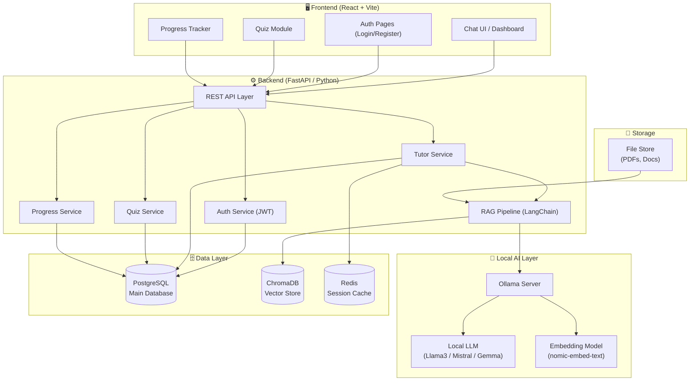
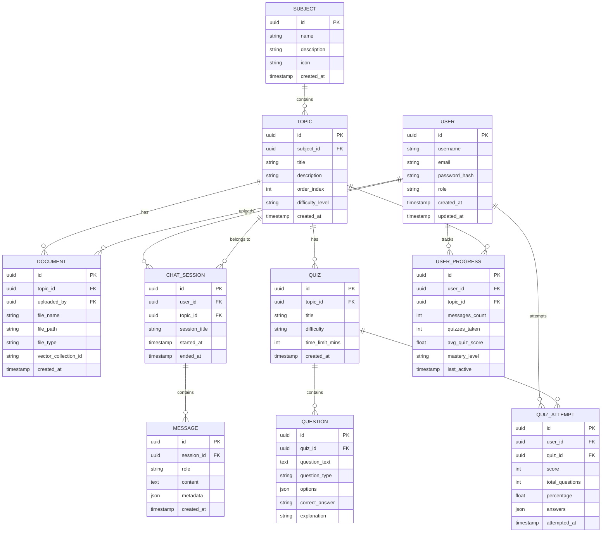
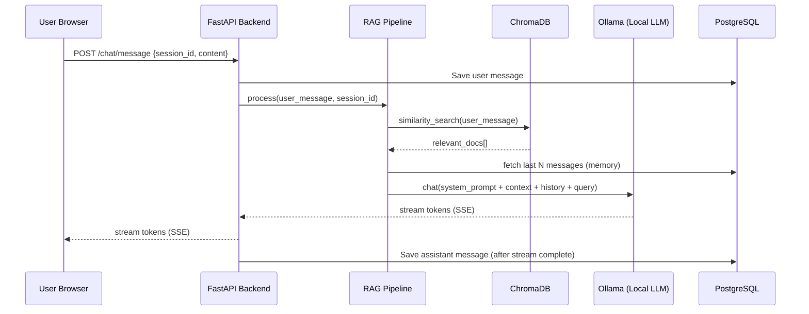

# 🎓 Deep Tutor MVP — AI Tutor Platform

## Overview

An AI-powered personalized tutor platform that uses a **local LLM** (via Ollama) to deliver intelligent, context-aware tutoring sessions. Students can ask questions, receive explanations, take quizzes, and track their learning progress — all powered by a locally running LLM for privacy and offline capability.

---

## 🏗️ Architecture Diagram



---

## 📊 ER Diagram



---

## 🛠️ Tech Stack Recommendations

### 🖥️ Frontend
| Layer | Technology | Why |
|---|---|---|
| Framework | **React + Vite** | Fast dev server, HMR, modern DX |
| Styling | **Tailwind CSS** | Rapid UI, utility-first, great defaults |
| State Mgmt | **Zustand** | Lightweight, simple, no boilerplate |
| Chat UI | **React Markdown + Highlight.js** | Render LLM markdown responses |
| HTTP Client | **Axios + React Query** | Caching, retries, background refetch |
| Routing | **React Router v6** | Industry standard SPA routing |
| Auth | **JWT stored in httpOnly cookie** | Secure token management |
| Charts | **Recharts** | Progress/analytics visualizations |

### ⚙️ Backend
| Layer | Technology | Why |
|---|---|---|
| Framework | **FastAPI (Python)** | Async support, auto docs, fast |
| Auth | **python-jose + passlib** | JWT + bcrypt hashing |
| ORM | **SQLAlchemy + Alembic** | Type-safe queries + migrations |
| LLM Orchestration | **LangChain** | RAG pipelines, memory, chains |
| Streaming | **Server-Sent Events (SSE)** | Real-time token streaming from LLM |
| Task Queue | **Celery + Redis** | Async document processing |
| Validation | **Pydantic v2** | Data models and validation |

### 🤖 Local AI Layer
| Component | Technology | Why |
|---|---|---|
| LLM Server | **Ollama** | Easy local LLM management |
| Chat Model | **Llama 3.1 8B / Mistral 7B** | Best quality/speed tradeoff for MVP |
| Embeddings | **nomic-embed-text** | Fast, high-quality local embeddings |
| Vector Store | **ChromaDB** | Local, file-based, easy to start |
| RAG Framework | **LangChain** | Retrieval-augmented generation |

### 🗄️ Database & Storage
| Layer | Technology | Why |
|---|---|---|
| Primary DB | **PostgreSQL** | Relational, reliable, JSON support |
| Vector DB | **ChromaDB** | Local vector search, no extra infra |
| Cache | **Redis** | Session store, rate limiting |
| File Storage | **Local filesystem / MinIO** | PDF uploads, documents |

### 🚀 DevOps (MVP)
| Tool | Purpose |
|---|---|
| **Docker + Docker Compose** | Run everything with one command |
| **Nginx** | Reverse proxy for Frontend + Backend |
| **Alembic** | DB schema migrations |

---

## 🗺️ MVP Feature Scope

### ✅ MVP Phase 1 (Build First)
- [x] User Registration & Login (JWT)
- [x] Subject & Topic Browsing
- [x] AI Chat Session with local LLM (streaming)
- [x] Document Upload + RAG (ask questions about uploaded PDFs)
- [x] Auto-generated Quizzes from LLM
- [x] Quiz Attempt & Scoring
- [x] Basic Progress Dashboard

### 🔜 Phase 2 (Post-MVP)
- [ ] Spaced Repetition System (SRS)
- [ ] Voice Input/Output
- [ ] Collaborative Study Rooms
- [ ] LLM Model switcher in UI
- [ ] Student analytics for teachers

---

## 📁 Project Structure

```
Deep_Tutor_MVP/
├── frontend/                  # React + Vite app
│   ├── src/
│   │   ├── components/        # Reusable UI components
│   │   ├── pages/             # Route-level pages
│   │   ├── stores/            # Zustand state stores
│   │   ├── services/          # API service functions
│   │   └── hooks/             # Custom React hooks
│   └── package.json
│
├── backend/                   # FastAPI application
│   ├── app/
│   │   ├── api/               # Route handlers
│   │   ├── services/          # Business logic
│   │   ├── models/            # SQLAlchemy models
│   │   ├── schemas/           # Pydantic schemas
│   │   ├── core/              # Config, auth, db
│   │   └── rag/               # LangChain RAG pipeline
│   ├── alembic/               # DB migrations
│   └── requirements.txt
│
├── docker-compose.yml         # Orchestrate all services
└── README.md
```

---

## 🔄 Data Flow — Chat Session



---

## ⚠️ Open Questions

> [!IMPORTANT]
> **Q1**: Should the MVP support **multiple subjects** (Math, Science, History) from day 1, or start with a single configurable subject?

> [!IMPORTANT]
> **Q2**: Do you want **teacher/admin roles** in the MVP, or just student accounts for now?

> [!IMPORTANT]
> **Q3**: Which local LLM would you prefer? Options:
> - **Llama 3.1 8B** — Great all-rounder, needs ~8GB RAM
> - **Mistral 7B** — Fast and instruction-tuned, needs ~6GB RAM
> - **Gemma 2 9B** — Google's model, excellent reasoning

> [!NOTE]
> **Q4**: Should we start building the **frontend first** (UI demo), **backend first** (API + LLM), or use **Docker Compose** to wire everything up together?
