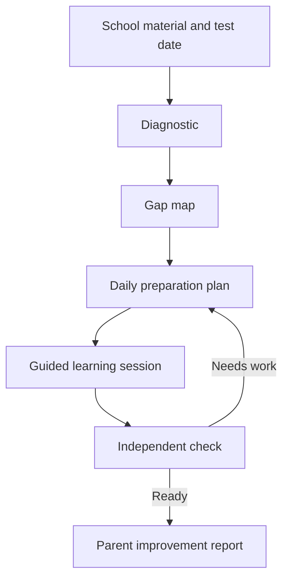

# 01 — MVP Definition

## Product thesis

Parents often know that a test is approaching but do not know:

- what the child is expected to learn;
- which concepts the child already understands;
- where the actual gaps are;
- what the child should study each day;
- whether studying produced genuine improvement.

General AI tools answer questions, while existing learning platforms often provide fixed content. The proposed product manages the complete preparation journey using the material actually supplied by the student's school.

## Initial customer and user

### Buyer

A parent or guardian in Sweden.

### Learner

A student in Swedish school year 7, 8, or 9.

### Initial subject

Biology, limited to a reviewed subset of Lgr22 concepts suitable for the pilot families' upcoming assessments.

### Initial language support

- Swedish as the curriculum and terminology language.
- English as the first alternative explanation and parent-report language.
- Other languages are excluded from the first release unless the pilot reveals a specific, concentrated need.

## MVP promise

> Upload the material for an upcoming Biology test. The programme identifies what your child understands, creates a daily plan, teaches the difficult concepts, and shows you what improved before test day.

The product must not promise a particular school grade or imply that its readiness score is an official assessment.

## Core user journey

1. The parent creates the account and child profile and provides consent.
2. The parent or child enters the test date and uploads the teacher's instructions, textbook pages, presentations, worksheets, or study questions.
3. The platform extracts and structures the material and maps it to the supported Lgr22 Biology concept model.
4. The student completes a short adaptive diagnostic.
5. The system produces a knowledge-gap report and preparation plan.
6. The student completes short guided sessions until test day.
7. Each session teaches, practises, checks independent understanding, and updates the future plan.
8. The student completes an unseen pre-test assessment.
9. The parent receives an improvement report, remaining gaps, and a final revision recommendation.
10. After the assessment period, the family is invited to prepare for another test or continue under a subscription.

## Core learning loop

## MVP scope

### Required

- Parent registration, authentication, consent, billing, export, and deletion.
- Separate child access with no access to parent or billing functions.
- Test-preparation workspace with subject, test date, and learning-material uploads.
- Durable background processing that survives refresh and browser closure.
- Reviewed Lgr22 Biology concept model.
- Short diagnostic assessment.
- Concept-level knowledge-gap map.
- Structured daily study plan.
- Guided teaching, practice, revision, and test-preparation modes.
- Source-grounded answers with appropriate citations to uploaded material.
- Progressive hints and anti-homework-completion behaviour.
- Independent mastery checks.
- Pre/post measurement using unseen reviewed questions.
- Parent dashboard and preparation-period report.
- Administrative support for failed processing, reported answers, safety events, and account actions.
- Usage, cost, retention, quality, and outcome measurement.

### Explicitly excluded

- Mathematics and other subjects.
- Primary school and upper-secondary school.
- India, UAE, and other curricula.
- Native mobile applications.
- Municipal or school procurement features.
- Teacher classroom administration.
- Live human tutoring marketplace.
- Social feeds, leaderboards, or student-to-student messaging.
- AI avatars and decorative gamification.
- General web research.
- Unlimited storage or AI usage.
- Official grades or guaranteed grade improvement.

## Biology pilot concept scope

The final subset must follow the actual pilot material and be reviewed by a qualified Swedish Biology teacher. Candidate areas are:

- cells, tissues, organs, and organ systems;
- health, infection, immunity, and lifestyle;
- ecosystems, food chains, biodiversity, and sustainability;
- DNA, inheritance, variation, adaptation, and evolution.

The MVP should support approximately 25–40 concepts, not the entire subject.

## Learning dimensions

Mastery must not be represented by one unexplained percentage. Evidence should be maintained across:

- terminology;
- factual knowledge;
- conceptual understanding;
- causal relationships;
- application to a new situation;
- scientific reasoning;
- structured communication;
- source evaluation where relevant.

Mastery states:

- Not assessed
- Beginning
- Developing
- Secure
- Mastered
- Needs revision

Every reported state must be connected to evidence such as reviewed questions, student attempts, hints used, detected misconceptions, and delayed recall.

## Primary product risks

1. Parents may be satisfied with ChatGPT, Alice, or existing school tools.
2. Students may use the application once and not follow the plan.
3. Families may value the report but refuse to pay.
4. Material supplied by schools may be incomplete, poor quality, or copyrighted.
5. AI-generated explanations and assessments may be inaccurate or pedagogically weak.
6. Child-data obligations may make institutional sales slow and expensive.
7. Biology may be technically suitable but have weaker willingness to pay than Mathematics.

The MVP exists to test these risks, not to hide them.

