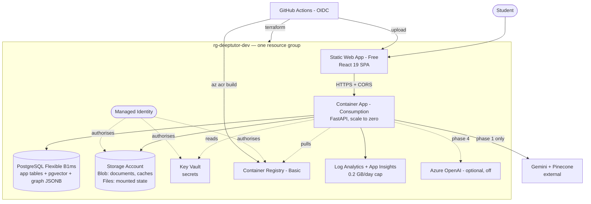

# Azure Deployment — Analysis and Plan

*Written 28 Aug 2026 against the repo at `e3295bb`. Prices are list prices at
the time of writing for Sweden Central; verify in the Azure pricing calculator
before committing budget. Supersedes the hosting section of
[`infra-and-cicd.md`](./infra-and-cicd.md), which recommended Render + Netlify;
the rest of that document — stateless-backend principle, repo cleanup, CI
shape — still stands and this plan is built on it.*

---

## 1. Recommendation in one paragraph

Put everything in **one resource group per environment**, run the API on
**Azure Container Apps (Consumption)**, the SPA on **Static Web Apps (Free)**,
and — this is the load-bearing choice — use **one PostgreSQL Flexible Server
(B1ms) with `pgvector`** as the relational database, the vector index, *and*
the knowledge-graph store. That single decision collapses three paid or
soon-to-be-paid services (Neon, Pinecone, and the disk the graph store is
currently losing data on) into one ~USD 16/month resource, and it is the
difference between a dev environment that costs ~USD 25/month and one that
costs ~USD 100. Use **Terraform**, deployed by **GitHub Actions with OIDC**, so
there are no stored cloud credentials anywhere.

**Estimated dev-tier run cost: ~USD 23–28/month.** Everything in this plan is
implemented on the branch `feat/azure-infra-terraform` and is ready to plan and
apply.

---

## 2. Where the deployment is today

Measured, not assumed:

| Fact | Evidence | Consequence on Azure |
|---|---|---|
| Frontend has config for **three** hosts | `frontend/netlify.toml`, `frontend/vercel.json`, root `vercel.json` | Three deploy paths, none authoritative. One of them wins by accident |
| API base URL is hardcoded to a Render host | [`api.ts:13`](../../frontend/src/services/api.ts#L13), `.env.production` | A Render outage or teardown breaks the app even after it moves to Azure |
| Backend on Render free tier | `ServerWarmupNotice` component exists | Cold starts are a product-visible problem today |
| **No `.github/` directory** | verified | CI/CD is greenfield. Nothing to migrate, nothing to fight |
| Graph store writes JSON to local disk | [`storage/graph_kv.py`](../../backend/app/rag/storage/graph_kv.py), `LIGHTRAG_DATA_DIR` | On any container platform this is **silent data loss on every deploy** |
| `DATABASE_URL` silently falls back to SQLite | [`database.py:33`](../../backend/app/core/database.py#L33) | A Postgres outage forks user data onto an ephemeral disk instead of paging someone |
| `requirements.txt` installs docling + easyocr → torch | `requirements.txt` | Multi-GB image for features disabled by default (`ENABLE_DOCLING=False`) |
| Data lives in four vendors: Neon, Pinecone, AWS S3, local disk | `config.py`, `DATABASES_USED.md` | Four bills, four dashboards, four failure modes, no single resource group |
| Git pack is 81 MB, mostly three PDFs | `git count-objects` | Every CI checkout pays for it |

The scattering is real: **the platform currently spans Render, Netlify, Vercel,
Neon, Pinecone, AWS, and Google AI.** Consolidating the *infrastructure* into
Azure is achievable now; consolidating the *data services* is a follow-up with
a real code cost, laid out in §6.

---

## 3. Target architecture

One resource group, `rg-deeptutor-dev`. One managed identity is the only
principal: it pulls images, reads secrets, and writes blobs. No connection
string, registry password, or deployment token is stored in GitHub.



### Why each SKU

| Layer | Choice | ~USD/month | Why this one |
|---|---|---|---|
| API | Container Apps, Consumption, 0.5 vCPU / 1 GiB, min 0 replicas | **0–3** | The monthly free grant (180k vCPU-s + 360k GiB-s) covers an idle dev environment. Same image runs the future worker. Scales without a migration |
| Frontend | Static Web Apps, **Free** | **0** | Global CDN, TLS, custom domains, 100 GB/month. Replaces Netlify *and* Vercel |
| Database + vectors + graph | PostgreSQL Flexible **B1ms**, 32 GiB | **~16** | Cheapest SKU that runs `pgvector`. One server does the work of Neon + Pinecone + the lost-on-restart disk |
| Object storage | Storage account, Standard LRS | **~1–2** | Blob replaces S3; Files gives the API a durable mount today |
| Registry | Container Registry **Basic** | **~5** | 10 GiB, and managed-identity pull means no registry password exists |
| Secrets | Key Vault, Standard | **~0.1** | Priced per 10k operations |
| Observability | Log Analytics + App Insights, 0.2 GB/day cap | **0–2** | 5 GB/month is free; the cap makes the worst case ~USD 2 |
| **Total** | | **~23–28** | |

Against the Render/Netlify plan in `infra-and-cicd.md` (~USD 15–20 plus free
Neon and Pinecone tiers), Azure costs roughly USD 8 more per month and buys:
one bill, one identity model, one IaC definition, durable storage for the graph
data that is being lost today, and no free-tier cliff to fall off at launch.

### The two choices worth arguing about

**Scale-to-zero versus always-warm.** `api_min_replicas = 0` is the dev
default and makes compute effectively free, at the price of a 10–20 second cold
start on the first request. If a warm demo endpoint matters more than the
money, note that Container Apps at `min_replicas = 1` costs about **USD 33/month**
— more than **App Service Linux B1 at ~USD 13**. If always-warm becomes a
requirement, switching the API to App Service is the cheaper answer, and it is
a contained change to `container_apps.tf`. Scale-to-zero is the right default
until someone asks for otherwise.

**Azure AI Search was considered and rejected.** It is the obvious "Azure
vector database", and its Basic tier is **USD 75/month** — three times the
entire rest of this environment. The Free tier caps at 50 MB and one per
subscription, which will not hold a textbook corpus. `pgvector` on a server
that has to exist anyway is both cheaper and simpler. Revisit AI Search when
semantic ranking and hybrid scoring become a product differentiator rather than
an infrastructure line item.

---

## 4. What will break — findings from the code

These are the things that turn a clean `terraform apply` into a broken
environment. Each is either handled in this branch or listed as required
follow-up work.

### 4.1 Graph data is lost on every deploy — *mitigated here*

`GraphKVStore` writes `entities.json` / `relations.json` / `triplets.json` to
`LIGHTRAG_DATA_DIR` on local disk. Container Apps replicas are disposable, so
every revision and every scale-to-zero cycle would discard the knowledge graph.
On Render today the same bug is already live.

**Handled:** an Azure Files share is mounted at `/data/lightrag`, and
`LIGHTRAG_DATA_DIR` points at it. That stops the loss with no code change.
**Still owed:** Azure Files is slow for many small JSON files, and concurrent
writers have no locking. The real fix is Postgres JSONB — §6.2.

### 4.2 Uploads land on disposable disk — *mitigated here*

`UPLOAD_DIR` is written by `documents.py`, `chat.py` and `notes.py` before the
S3 copy. Same mount treatment: `/data/uploads` is an Azure Files share.

Related: `MAX_UPLOAD_SIZE_MB` is **5000**. Container Apps ingress will not carry
a 5 GB upload in one request, and gunicorn's timeout would expire long before
it finished. Nobody has hit this because nobody has tried. Lower the limit to
something the platform can actually serve, or move to direct-to-blob uploads
with a SAS URL.

### 4.3 The image cannot drop ChromaDB yet — *worked around*

`requirements.txt` pulls docling, easyocr and pytesseract, which pull torch.
`backend/requirements-core.txt` in this branch omits them and
`backend/Dockerfile.slim` builds from it, taking the image from multiple GB to
well under one — which is what makes a 0.5 vCPU / 1 GiB replica and a fast cold
start viable.

ChromaDB could not be dropped with it. `app/rag/vector_store.py` imports
`chromadb` at module scope, and `app/api/chat.py`, `documents.py`,
`graph_rag.py`, `flashcard_generator.py`, `study_plan_generator.py` and
`section_scope.py` all import that module at *their* module scope — so it loads
on every boot even though Pinecone is the active backend. Same story for
`networkx` via `graph_store.py`. Making those imports lazy (matching the
pattern `storage/__init__.py` already uses) removes a few hundred MB and one
whole dependency tree. Small change, real payoff, not done here because it
touches six API modules.

### 4.4 CORS is wide open and the env var is ignored — *not fixed, blocking*

[`main.py:58`](../../backend/app/main.py#L58) sets `allow_origins=["*"]`.
Terraform passes a correct `CORS_ALLOWED_ORIGINS` to the container; nothing
reads it. Before this environment is shared with anyone outside the team, that
middleware must read the variable. It is a five-line change and it is the one
item on this list that is genuinely security-relevant.

### 4.5 `/health` bills an LLM call per probe — *worked around*

`/health` calls `ollama.is_available()`, which for `LLM_PROVIDER=gemini` calls
`gemini.is_available()` — a live Gemini request — and then runs a database
query. Wired to a container probe at 15-second intervals that is roughly 5,700
Gemini calls a day for a health check.

The probes in `container_apps.tf` therefore point at `/`, which returns static
JSON. The right fix is to split the endpoint: `/health/live` returning
`{"status":"ok"}` with no I/O, `/health/ready` checking the database only, and
the current expensive view kept behind `/health` for humans.

### 4.6 The SQLite fallback hides a Postgres outage — *not fixed*

`_create_engine_with_fallback` catches a Postgres connection failure and
silently switches to a local SQLite file. On a disposable container that means
an outage produces a working-looking API writing user data to a disk that is
about to vanish. In a deployed environment this must raise. Keep the fallback
behind an explicit local-dev flag.

### 4.7 Routers are mounted twice — *cosmetic, worth cleaning*

Every router is registered at both `/api/...` and `/...`, doubling the route
table and the OpenAPI document. The frontend only calls `/api/*`. Drop the
duplicate once that is confirmed.

---

## 5. Terraform, and why not Bicep

Either would work. Terraform, because:

- **It is not Azure-only.** S3, Pinecone, Neon, Netlify and Cloudflare all have
  providers. During the migration window — which is months, not days — the same
  tool describes the resources that have not moved yet. Bicep can only ever
  describe the Azure half.
- **`plan` is a genuine review artifact.** The `infra-plan` workflow posts it
  on the PR, so a reviewer sees "3 to add, 1 to change, 0 to destroy" before
  approving. Bicep's what-if is less precise on nested and list properties.
- **State is explicit.** A versioned blob you can inspect, lock and roll back,
  rather than deployment history inferred from the resource group.
- **The sovereign-bundle path in `differentiation.md` implies non-Azure
  targets.** Terraform keeps that door open.

The cost is honest: an extra tool, a state file to protect, and provider
version drift. The bootstrap script enables blob versioning and 30-day soft
delete on the state container, which turns state corruption from a rebuild into
a two-minute restore.

**Verification status:** the configuration has not been run against a live
subscription — no Azure CLI or Terraform binary exists in this workspace. The
`infra-plan` workflow (`fmt -check` → `init` → `validate` → `plan`) is the gate,
and it runs on the first PR from this branch. Expect the first plan to surface
one or two provider-schema fixes; that is what the gate is for.

---

## 6. Migration path

Phase 1 ships an environment that runs the app *as it is today*. Nothing is
rewritten to get it live.

### Phase 1 — Lift onto Azure *(this branch; ~2 days including a first apply)*

Deploy the resource group. Backend stays on **Gemini + Pinecone + S3**;
`DATABASE_URL` points at the new Flexible Server. Azure Files mounts stop the
graph-data loss. Retire Vercel; keep Netlify running until the Static Web App
is proven, then delete `netlify.toml` and both `vercel.json` files.

**Exit proof:** a push to `main` reaches a working URL with no human step, and a
deliberate revision restart loses zero data.

### Phase 2 — S3 → Azure Blob *(~2 days)*

`s3_store.py` is a clean, self-contained class. Add `azure_blob_store.py`
behind the same interface with an `azure-storage-blob` client authenticating
via the managed identity already in place, select it with a `STORAGE_BACKEND`
setting, and copy the bucket with `azcopy`. Removes the AWS bill and the last
long-lived access key.

### Phase 3 — Graph KV → Postgres JSONB *(~3 days)*

Replace the per-topic JSON files with a `graph_kv` table keyed by
`(topic_id, kind, entity_id)` holding JSONB. `GraphKVStore` already has a
narrow interface, so this is a backend swap, not a redesign. Fixes concurrent
writes and the Azure Files latency in one move. This is also when the ARQ
worker and a queue become worth provisioning — flip `enable_worker = true` and
add a Redis container app or Azure Cache Basic at that point, not before.

### Phase 4 — Pinecone → pgvector *(~1 week, the real work)*

`PineconeVectorStore` is ~550 lines and does more than store vectors: BM25
sparse search, RRF fusion, page-filtered lookups, namespace management. A
`PgVectorStore` must reproduce all of it. Postgres gives good answers for each
piece — `vector` with an HNSW index for dense search, `tsvector` /
`ts_rank_cd` for sparse, the fusion arithmetic ported as-is — and having both
in one query engine makes hybrid retrieval a single SQL statement instead of
two round trips. Budget a week and re-run the RAGAS suite against the result;
the retrieval quality numbers in `rag_evaluation_report.md` are the acceptance
gate.

### On Azure OpenAI *(decision, not a phase)*

The Terraform module exists and is **off**. Enabling it is nearly free — S0 is
pay-per-token — but switching *embeddings* to `text-embedding-3-small` changes
the vector dimension and forces a full re-index of every document. Two
defensible positions: keep Gemini (zero migration, currently cheaper per token,
one less thing to change during a platform move), or move chat to Azure OpenAI
for data-residency reasons while leaving embeddings on Gemini. Do not switch
both at once, and do not switch during Phase 4.

---

## 7. What is on this branch

```
infra/
  bootstrap/bootstrap.sh|.ps1     one-time Terraform state storage
  terraform/                      the environment, ~15 resources
    envs/dev.tfvars               the cheap dev shape
  README.md                       the runbook

.github/workflows/
  infra-plan.yml                  PR: fmt, validate, plan, comment on the PR
  infra-apply.yml                 main + manual: apply behind an environment approval
  deploy-backend.yml              az acr build, roll the revision, smoke test with log dump
  deploy-frontend.yml             build with the live API URL, upload to Static Web Apps

backend/
  Dockerfile.slim                 multi-stage, non-root, no torch
  requirements-core.txt           what the API actually imports
  requirements-ocr.txt            the OCR extras, installed only where enabled
  .dockerignore                   keeps caches, evals and .env out of the build context
```

Setup is in [`infra/README.md`](../../infra/README.md): bootstrap state, create
the OIDC identity, set six repository variables, create the `dev` environment
with reviewers, apply, populate four Key Vault secrets, deploy.

Nothing under `backend/app/` or `frontend/src/` was modified. The existing
`backend/Dockerfile` is untouched so the Render deployment keeps working until
Azure is proven; `Dockerfile.slim` should replace it once it is.

---

## 8. Risks, stated plainly

| Risk | Severity | Handling |
|---|---|---|
| First `terraform apply` hits a provider-schema mismatch | Likely, low impact | `infra-plan` catches it on the PR; fix and re-plan |
| B1ms Postgres is undersized once pgvector holds the corpus | Medium | Burstable scales to B2s and beyond in place; measure at Phase 4, do not pre-buy |
| Cold start makes the first request of a demo look broken | Medium, product-visible | Set `api_min_replicas = 1` before a demo, or move to App Service B1 if it becomes permanent |
| Azure Files latency on many small graph JSON files | Medium | Real, and the reason Phase 3 exists. Acceptable at beta document volumes |
| CORS `*` shipped to a shared environment | **High if unfixed** | §4.4 — fix before sharing the URL |
| Terraform state corruption | Low | Blob versioning + 30-day soft delete, enabled by the bootstrap script |
| Sweden Central capacity for a SKU | Low | Region is a variable; `westeurope` is the fallback |

**Open questions for the team, before the first apply:**

1. Is there an existing Azure subscription and tenant, or does one need
   creating? A free trial's USD 200 credit covers roughly seven months of this
   environment.
2. Sweden Central for data residency, or West Europe? Static Web Apps runs in
   West Europe either way — it holds no personal data.
3. Does the first environment need to be always-warm for demos? That is the
   USD 0 versus USD 33 decision in §3.
4. Who owns the Entra app registration for OIDC? It needs
   `User Access Administrator` for the first apply, which is more than a
   typical developer holds.
