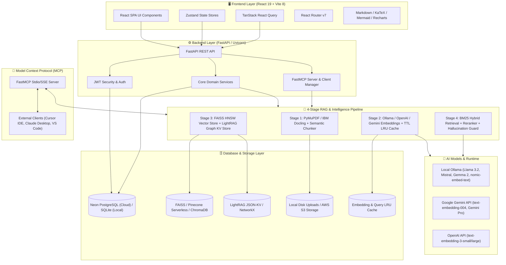
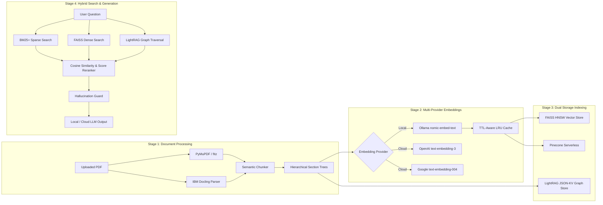
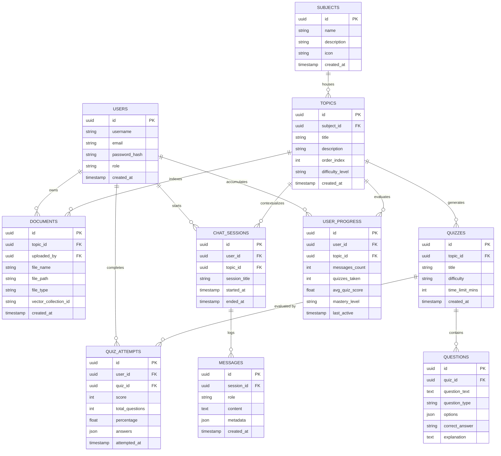
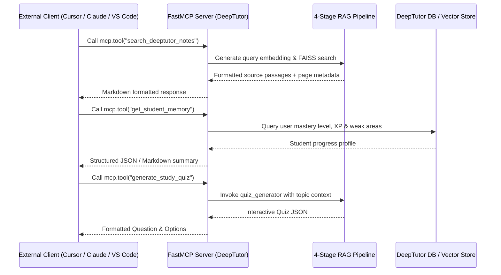

# 🛠️ DeepTutor — Comprehensive Tech Stack & System Architecture

> **DeepTutor** is a privacy-first, local & multi-provider AI-powered personalized tutoring platform. It integrates a 4-Stage RAG (Retrieval-Augmented Generation) Pipeline, GraphRAG knowledge structures, dynamic quiz & flashcard generation, interactive student analytics, and Model Context Protocol (MCP) capabilities.

---

## 📐 1. System Architecture Overview

DeepTutor follows a decoupled client-server architecture designed for high scalability, offline capabilities, and local-first execution with fallback options for cloud-based providers.

---

## 🧰 2. Complete Technology Stack

### 🖥️ Frontend Architecture

| Category | Technology | Version | Purpose & Description |
|---|---|---|---|
| **Core Framework** | React | `^19.2.8` | Declarative UI component tree structure with high-concurrency features |
| **Build Tooling** | Vite | `^8.2.0` | Ultra-fast HMR module bundling and TypeScript compilation |
| **Language** | TypeScript | `~6.0.2` | End-to-end static type safety and interface definitions |
| **Styling** | Tailwind CSS | `^4.3.3` | Utility-first CSS engine with `@tailwindcss/vite` integration |
| **Typography** | Google Fonts | `^5.3.0` | Fonts (`@fontsource/fredoka`, `@fontsource/nunito`, `@fontsource/outfit`) |
| **Icons** | Lucide React | `^1.28.0` | Clean vector iconography set |
| **State Management** | Zustand | `^5.0.14` | Lightweight state containers (`authStore`, `chatStore`, `subjectStore`) |
| **Data Fetching** | TanStack Query + Axios | `^5.101.4` / `^1.19.0` | Declarative async state caching, auto-refetching, and HTTP requests |
| **Routing** | React Router DOM | `^7.18.2` | Single Page Application (SPA) client-side routing |
| **Animations** | Framer Motion | `^12.43.0` | Micro-animations, page transitions, interactive UI gestures |
| **Visual Effects** | Canvas Confetti | `^1.9.4` | Gamified reward animations for quiz completion |
| **Data Visualization** | Recharts | `^3.10.1` | Analytics charts, performance breakdown, mastery metrics |
| **Markdown Parsing** | React Markdown + GFM | `^10.1.0` / `^4.0.1` | Rendering rich formatted responses from LLM |
| **Formula Rendering** | KaTeX + Rehype/Remark | `^0.18.4` | High-fidelity mathematical expression rendering (`$E=mc^2$`) |
| **Code Highlighting** | Highlight.js | `^11.11.1` | Syntax highlighting for code snippets in chat and notes |
| **Diagrams & Graphs** | Mermaid | `^11.17.0` | Dynamic sequence charts, flowcharts, and 3D graph visualizers |
| **Linter** | Oxlint | `^1.75.0` | Fast Rust-based JavaScript/TypeScript linter |

---

### ⚙️ Backend Architecture

| Category | Technology | Version | Purpose & Description |
|---|---|---|---|
| **Web Framework** | FastAPI | `>=0.111.0` | Asynchronous high-performance Python web application framework |
| **ASGI Server** | Uvicorn | `>=0.30.0` | Standard ASGI server implementation with live reloading capabilities |
| **Database ORM** | SQLAlchemy | `>=2.0.0` | Modern Python SQL toolkit and Object Relational Mapper |
| **Data Validation** | Pydantic & Settings | `>=2.7.0` | Environment validation and strongly typed API request/response schemas |
| **Authentication** | Passlib & Python-JOSE | `>=1.7.4` / `>=3.3.0` | Bcrypt password hashing and JWT token processing |
| **Async Drivers** | AIOSQLite / Psycopg2 | `>=0.20.0` / `>=2.9.9` | Asynchronous SQLite driver & PostgreSQL binary driver |
| **HTTP Client** | HTTPX & AIOFiles | `>=0.27.0` / `>=23.2.1` | Non-blocking HTTP client and async filesystem operations |
| **Retry & Utilities** | Tenacity & Python-Dotenv | `>=8.3.0` / `>=1.0.0` | Execution retries with exponential backoff and env management |
| **Cloud Storage SDK** | Boto3 | `>=1.34.0` | AWS S3 object storage connector for document backups |

---

## 🔬 3. The 4-Stage Advanced RAG Pipeline Architecture

DeepTutor features a multi-tiered Retrieval-Augmented Generation (RAG) framework optimized for structured academic textbooks and complex documents.

### Stage 1: Document Parsing & Semantic Chunking
- **Parsers**:
  - **PyMuPDF (`fitz`)**: Primary high-speed text and layout extractor.
  - **IBM Docling (`docling`)**: Deep structural parser for multi-column academic papers, complex tabular data, formula extraction, and OCR.
  - **Fallbacks**: `pdfplumber`, `pypdf`, `pytesseract`, `easyocr`, `python-docx`, `openpyxl`, `python-pptx`, `beautifulsoup4`.
- **Semantic Chunker**: Dynamically partitions documents based on heading hierarchy (`section_tree.py`) with configurable word windows (`CHUNK_MIN_WORDS` to `CHUNK_MAX_WORDS`).

### Stage 2: Multi-Provider Embeddings & Caching
- **Providers**:
  - **Local**: Ollama `nomic-embed-text` (768 dimensions).
  - **OpenAI**: `text-embedding-3-small` / `text-embedding-3-large`.
  - **Google Gemini**: `text-embedding-004`.
- **Caching**: Memory-resident TTL-aware LRU cache (`cachetools`) preventing duplicate vector computations for frequent queries and document re-indexing.

### Stage 3: Dual Storage Indexing (Vector + Knowledge Graph)
- **Vector Store Backends**:
  - **FAISS HNSW** (`faiss-cpu`): Primary local vector index for high-speed nearest-neighbor retrieval.
  - **Pinecone Serverless**: Cloud-native scalable vector repository fallback.
  - **ChromaDB**: Legacy persistent file vector storage support.
- **Graph RAG**:
  - **LightRAG**: Entity-relation extraction indexed in JSON-KV structures (`graph_kv.py`).
  - **NetworkX**: Dynamic entity traversal and graph algorithms powering 3D knowledge map rendering.

### Stage 4: Advanced Hybrid Retrieval & Generation
- **Hybrid Retrieval**: Combines BM25+ sparse lexical matching, FAISS dense vector search, and multi-hop knowledge graph neighborhood traversals.
- **Reranking**: `scikit-learn` cosine similarity utilities and relevance scoring filters out out-of-context chunks.
- **Hallucination Guard**: `hallucination_guard.py` evaluates source context alignment before dispatching prompts to Ollama (`llama3.2`, `mistral`, `gemma2`) or Gemini API.

---

## 🗄️ 4. Data Layer & Database ER Schema

DeepTutor uses a flexible database adapter pattern supporting both cloud **Neon PostgreSQL** and local **SQLite**.

---

## 🔌 5. Model Context Protocol (MCP) Integration

DeepTutor incorporates native **Model Context Protocol (FastMCP)** endpoints via `app/mcp_server.py` and `app/mcp_client.py`. This allows external IDEs and agents (e.g., Cursor, Claude Desktop, VS Code) to interact with DeepTutor's internal RAG pipeline and student data.

### Exposed MCP Tools

1. **`search_deeptutor_notes(query: str, topic_id: str)`**
   - Performs semantic vector search on uploaded PDF textbook notes.
2. **`get_student_memory(user_id: str)`**
   - Fetches mastery levels, strength/weakness analytics, and XP statistics.
3. **`generate_study_quiz(topic_id: str, difficulty: str, num_questions: int)`**
   - Dynamically crafts targeted practice quizzes directly from document context.
4. **`get_knowledge_graph_nodes(topic_id: str)`**
   - Exposes extracted 3D Knowledge Graph entities and semantic connections.

---

## 🚀 6. Infrastructure & Deployment Environment

- **Development Servers**:
  - Frontend: Vite Dev Server running on port `5173`.
  - Backend: FastAPI Uvicorn ASGI running on port `8000`.
  - Local AI: Ollama Daemon listening on `http://localhost:11434`.
- **Deployment Platform Configurations**:
  - **Netlify**: `netlify.toml` single-page application routing configurations.
  - **Vercel**: `vercel.json` rewrites and routing rules.
  - **Docker**: `Dockerfile` for multi-stage Python containerization.
  - **Automation Scripts**: `start.bat`, `add_user.py`, `reset_db.py`, `export_docling_markdown.py`.
